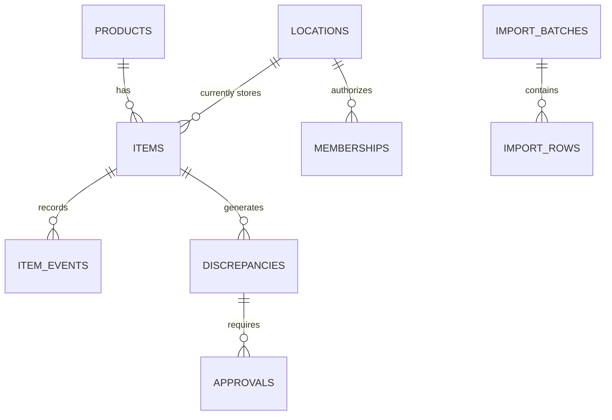

# Inventory Architecture Review — Fictional Sample (Public Portfolio)

**Purpose:** Demonstrate TaskForge's approach to a discovery-only inventory architecture engagement. All names, SKUs, warehouses, data fields and example rows below are synthetic. **This is not a client implementation, production case study, paid deliverable or proof of real-world inventory deployment.**

## Decision summary

A two-store + one-warehouse retail inventory pilot should treat **the individual physical item** as distinct from its product SKU, and it must retain an **append-only audit trail** of location changes and corrections. AS400 exports remain the declared source during initial migration until owners approve cutover.

### Candidate domain entities

| Entity | Key fields | Purpose |
| --- | --- | --- |
| `products` | `product_id`, `sku`, `description`, `active` | Product catalog and shared SKU identity |
| `items` | `item_id`, `product_id`, `serial_number`, `current_location_id`, `status`, `version` | Individually tracked piece; uniqueness scope for serial numbers to be confirmed |
| `locations` | `location_id`, `name`, `type` (store / warehouse / bin) | Controlled destinations, not free-form user text |
| `item_events` | `event_id`, `item_id`, `event_type`, `from_location_id`, `to_location_id`, `actor_id`, `occurred_at`, `reason`, `approval_id` | Append-only history for traceability |
| `import_batches` | `batch_id`, `source_name`, `file_hash`, `imported_by`, `imported_at`, `state` | Idempotent import and replay protection |
| `import_rows` | `batch_id`, `row_num`, `source_sku`, `source_serial`, `raw_record`, `validation_status`, `error_code` | Preserve source and explain rejects |
| `discrepancies` | `discrepancy_id`, `item_id`, `reported_location_id`, `observed_location_id`, `reported_by`, `status`, `resolved_by` | Variance investigation |
| `approvals` | `approval_id`, `discrepancy_id`, `requested_by`, `reviewed_by`, `decision`, `reviewed_at`, `reason` | Two-person signoff for restricted corrections |
| `memberships` | `user_id`, `location_id`, `role` | Per-site access controls |

Logical diagram:

## AS400/CSV import acceptance plan

1. Obtain **authorized redacted extracts** and field definitions; identify true unique keys, source-of-truth precedence, encoding, fixed-width or CSV parsing rules, null conventions and duplicate semantics.
2. Preserve source bytes and hash batch. Stage to `import_rows`; never replace live items immediately.
3. Validate SKU existence, serial-number collision scope, valid locations, quantity/serial consistency, dates, leading zeros and duplicate batches.
4. Generate preview counts: source rows, accepted, quarantined, unmatched, conflicts and location changes. Preserve rejected rows and error codes.
5. Allow a human operator to approve staging. Apply transactional upserts with idempotency and optimistic version checks; journal item location events.
6. Reconcile counts and sample item histories after import. Document rollback/replay constraints.

## Mobile scan and correction model

- A scan reads an item ID / serial and verified location ID; neither a barcode nor a staff claim automatically approves a stock correction.
- Record an observation first. If the observed location differs, create a discrepancy, not an immediate location overwrite.
- Managers approve or reject with a reason; record actor, timestamp, source event ID and previous/new values; restrict self-approval where the client's policy requires separation.
- Define a network-disconnection policy up front: queue observations with idempotency keys and server conflict handling; do not promise offline updates unless tested.

## Access and security questions

- Role matrix: store associate can scan only their assigned location; inventory manager can propose a correction; authorized approver can resolve it; system administrator manages permissions but cannot erase audit logs.
- Use database-level permissions/RLS where appropriate, never trust frontend-only filtering, and test cross-location denial.
- Encrypt transport and storage using supported managed-platform features, with minimum-privilege service credentials, documented key handling, retention and incident recovery.
- Clarify data residency, audit retention, backups, restore-point objective, disaster-recovery ownership and user provisioning with the buyer.

## Phase-gated implementation suggestion

- **Phase A — paid discovery only:** review the client's spec, prototype, source formats and sample data; issue ERD, role matrix, import contract, exception handling, risk register, hosting estimates and acceptance milestones.
- **Phase B — separately quoted engineering:** implement import pipeline, item history and RBAC against client-owned dev accounts; test with synthetic/redacted data.
- **Phase C — separately quoted staging pilot:** add scans, approvals, audit exports and location reconciliations with real authorized samples.
- **Phase D — separately quoted production readiness:** backups/restore rehearsal, monitoring, training, secure rollout and written acceptance.

## Explicit nonclaims

No real client data, no completed production installation, no guaranteed performance, no calculated hosting cost and no integration with a real AS400 have been verified in this sample. Final pricing and sequence depend on the buyer's actual specification and security requirements. All client code, accounts and repositories should be owned by the client from day one.
